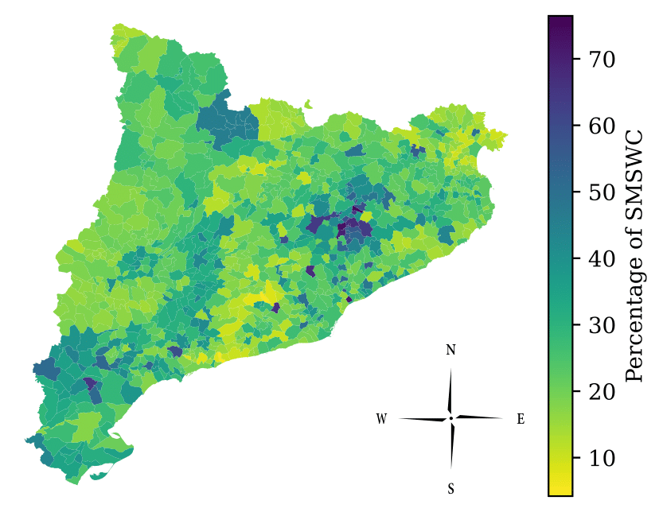
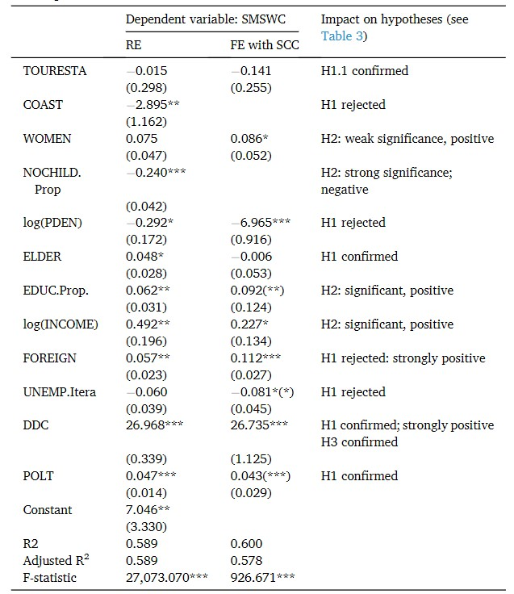

#### This publication originated from my BSc thesis, which I improved with the help of my supervisors to produce this article. It was accepted for publication in the journal Cities

### Abstract

A study of the factors influencing waste sorting behaviours is crucial to assess the current urban waste management schemes and to determine additional, appropriate policies to put in place. While there exist many theoretical considerations on which factors determine the Sorted Municipal Solid Waste Collection (SMSWC) rates, these are sometimes ambiguous, and firm empirical confirmation is often lacking. The present study estimates econometric models based on a comprehensive set of longitudinal data for all 945 Catalonian municipalities from 2000 to 2019. We demonstrate and quantify geographic, demographic, socioeconomic, and policy design determinants of the SMSWC rates at a municipal level. New insights are obtained on the effects of geographic conditions, unemployment, and foreign population on waste management behaviours, sometimes in direct contradiction with earlier theoretical expectations. The empirical evidence suggests that active waste collection policies can serve to increase the rate of sorted waste collection rapidly enough to achieve the recycling goals set by the European Union legislation and the Spanish Waste Law. Additionally, the study highlights the importance of considering demographic trends and differences in waste sorting behaviour between social groups when tackling waste management issues. The main qualitative results are expected to be valid beyond the concrete case of Catalonia.

<figure>
<figcaption>Figure 1. Average selective Municipal Solid Waste collection rate in 945 municipalities of Catalonia, 2000–2019.</figcaption>

</figure>

<figure>
<figcaption>Figure 2. Regression results for sorted MSW collection rate in 945 Catalonian municipalities.</figcaption>

</figure>
