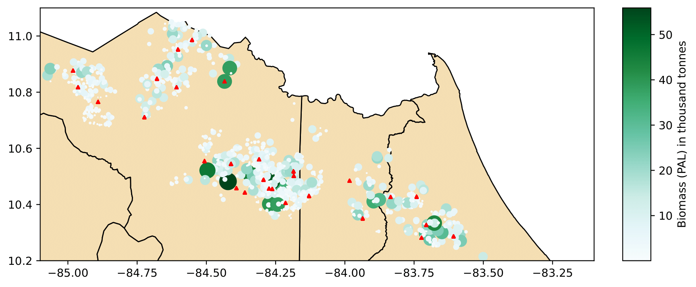
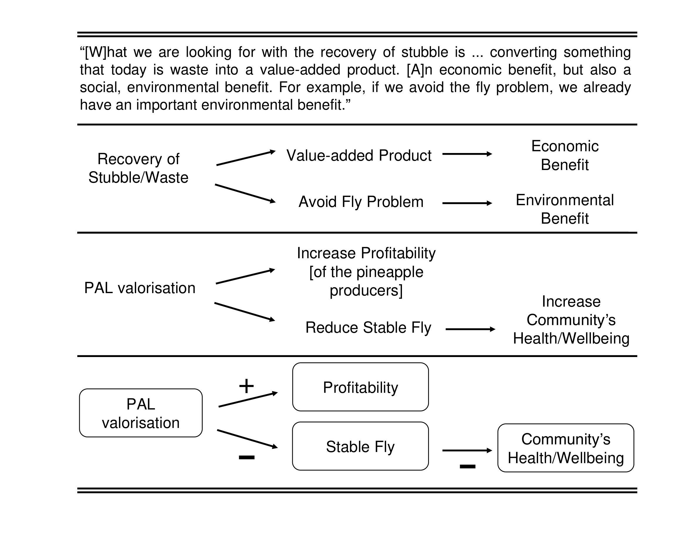

I conducted my MSc thesis at the Environmental Economics and Natural Resources Group at Wageningen University & Research. I did fieldwork in Costa Rica, where I interviewed pineapple farmers, researchers, and government officials. I studied the current state of pineapple leaves valorisation in Costa Rica, analyzed the barriers preventing the adoption of valorisation processes and the transition to a circular bioeconomy, and proposed a Facility Location Problem optimization model to improve the current situation.

## Abstract

The management of pineapple crop residues generates significant environmental and economic costs in Costa Rica. Using these residues to produce value-added products can benefit both the pineapple industry and the circular bioeconomy. Although several valorisation options have been studied, none have been implemented on a large scale. This study presents the state-of-the-art in the extraction and valorisation of Pineapple Leaves (PAL) in Costa Rica. Using the Fuzzy Cognitive Map method, I analyze the barriers preventing the adoption of valorisation processes and the transition to a circular bioeconomy.To model a potential logistical solution for the valorisation of PAL, I present a Facility Location Problem that optimizes the number and location of valorisation facilities to minimize operational costs. 

The study shows that unsustainable practices, lack of collaboration, and insufficient funding are the main barriers to circular-oriented innovation in the industry. Additionally, operational and technological challenges, particularly related to the extraction of PAL from the field, hinder progress toward large-scale solutions. Government agencies can be potential drivers of change, and there is a need for transparency and knowledge sharing. Raising awareness of the benefits of valorising PAL is essential to motivate investors. 

A decentralized valorisation operation is more suitable for biogas production, considering the spatial distribution of pineapple fields in Costa Rica and the processing capacity of biogas plants. The model presented can be used to analyze the most cost-effective operational solutions for different types of valorisation techniques, including cascaded solutions.

<figure>
  <figcaption>Figure 1. Spatial representation of the optimal solution for the FLP.</figcaption>
  
</figure>

<figure>
  <figcaption>Figure 2. Example statement processing to build FCM concepts and connections.</figcaption>
  
</figure>

    <a href="MScThesis.pdf" download="MScThesis">
        Download thesis in PDF <i class="fa fa-download"></i>
    </a>

  <body>
    <iframe
    src="MScThesis.pdf#toolbar=0" width="100%" height="500px">
    </iframe>
  </body>
</html>

